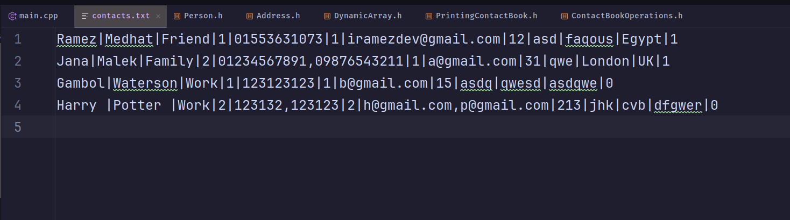

# Contact-Book
A comprehensive console-based application for managing contact information.

## Project UML

## Project Details
### 1# Main Page
At the start of the program the project has no data, you have the option to add a data or import it from a file

You can also see the different options for the program, If we pressed entered option 11, It will load the data from a file named “contacts.txt”

### 2# Loading from a file 
This is the result of loading the data from a file.

### 3# Saving to a file
At any point of the program we can save the data in the same file, this is the resulting file

### 4# Adding new contacts
We can add a new contact by selecting option 1, and typing the data one by one.

### 5# Editing Contact
We can edit a contact by selecting option 2, and typing the data one by one, if there’s a field we don’t want to edit we don’t type anything and just hit enter.

Here we edited the second name only from “Star” to “Moon”.

### 6# Deleting Contact
We can delete a contact by selecting option 3, and type the index of the contact.

### 7# Sorting
We can sort the contacts by name, select option 4

### 8# Reversing
We can reverse the contacts order, select option 5

### 9# Search
We can search in the contact book by name, select option 6 and enter the first and last name of the contact.

If no such name found, this is the result:

### 10# Filter by Classification
We can filter the contacts by classification, select option 7 and enter the classification filter, a list will show for you like this:

### 11# Print favorite contacts
We can print only the favorite contacts, select option 8.

### 12# Share a contact
If you selected option 8 and then entered the index of a contact, It will save the contact details in a file so you can share this file easily.

The file looks like this:

### 13# END :) 

***

This project was a task for the data structure course 2024 at Zagazig University, Was a good opportunity to learn.

##### Thank you for caring ✨🪐
